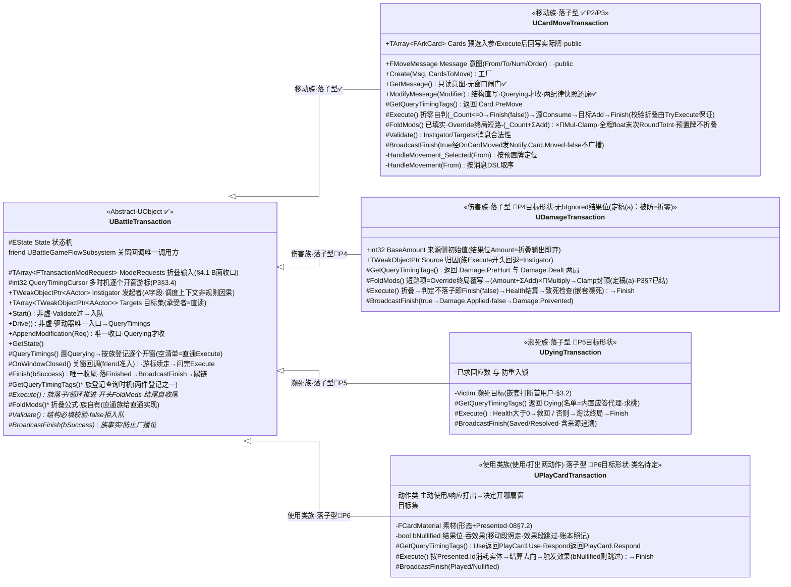
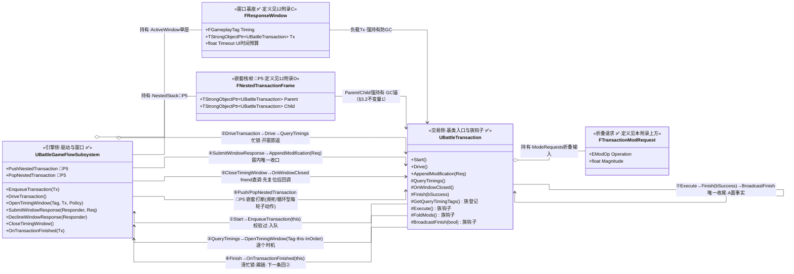

# 04 交易模型

> 结算载体：一切"会发生事"都做成有生命周期的交易对象。"延迟结算"即交易悬停在查询阶段——
> **交易就是停泊点，不依赖任何函数栈存活**。
> 落地：`Battle/Transaction/`（`UBattleTransaction` 基类与子类同目录）+ 流程子系统交易队列驱动。

## 1. 职责边界

| 管 | 不管 |
|---|---|
| 交易生命周期（五态）与统一终局 | 时机如何开窗收响应（`03`/`10`） |
| 交易队列、忙锁、嵌套规则 | 阶段怎么走（`02`） |
| 落子动作的执行入口（子类 `Execute`） | 具体规则数值判定（数据/语义层） |
| 交易对状态/容器的最终写入（经接口） | 复制与客户端表现（`11`） |

## 2. 生命周期（五态）

状态枚举保留在 `UBattleTransaction` 类内（现行 `.h`；未迁 `EventTypes.h`，见 §7）：

```cpp
enum class EState : uint8 { Spawned, Started, Querying, Executed, Finished };
```

```
创建方(Start) ──> Started ──Enqueue──> [驱动]
                驱动──(P3+)QueryTimings──> Querying（窗口悬停；可修改/防止）
                最终收敛 ──> Executed：Execute 落子 → Finish(true)
                              防止/无效：被防不 Execute，或 Execute 内判定无结果 → Finish(false)
                两者统一 ──> Finished ──回调管理器──> 踢下一条
```

生命周期方法（入口非虚；族钩子为虚，见下"要点"）：

- **`Start()`** — 调用方：创建方（阶段体/技能/调试）。
  职责：服务器门控 → 调族钩子 `Validate()`（必填校验）→ 防重入门控（`State != Spawned`）
  → `Started` → 入队 `EnqueueTransaction(this)`。
- **`Validate()`** — 调用方：`Start()` 内部（**受保护虚钩子**，族实现）。
  职责：族必填校验：读本族携带的意图字段是否完整/有效；`false` 拒绝入队（可修复后重试
  `Start`）。现行 `.h` 为 `PURE_VIRTUAL`——族必须实现，无默认放行。
- **`QueryTimings()`** — 调用方：`Drive()`（**P3 已落**）。
  职责：置 `Querying`（收修改的状态闸门）→ 按族登记（`GetQueryTimingTags`）逐个开 `03` 查询时机窗口；
  无登记时机 = 直通族，不开窗直接 `Execute`。
- **`OnWindowClosed()`** — 调用方：窗口关闭（`CloseTimingWindow` 直调，friend 准入；**P3 已落**）。
  职责：汇总结果 → 有可落子结果走 `Execute`；被防止/无效直接 `Finish(false)`（不 Execute）；
  清单还有未问时机则开下一扇（`QueryTimingCursor`）。
- **`Drive()`** — 调用方：管理器（`DriveTransaction`）。**驱动器唯一入口，非虚**：
  P3 起直调 `QueryTimings()` 开窗——入口名与调用方不变，
  族钩子 `Execute()` 保持受保护，驱动器不再直接触碰。
- **`Execute()`** — 调用方：`Drive()`（驱动器）/ `OnWindowClosed()`（窗口收敛；受保护纯虚，族实现）。
  职责：真正的落子：开头调 `FoldMods()` 收敛，**结束自收尾** `Finish(true)`；
  判定不落子（被防/空/归零）→ `Finish(false)`。
- **`Finish(bool bSuccess)`** — 调用方：`Execute` 内部（**唯一收尾入口**，非虚）。
  职责：落 `Finished` → 调族钩子 `BroadcastFinish(bSuccess)` → 回调管理器踢下一条。
- **`BroadcastFinish(bool bSuccess)`** — 调用方：`Finish()` 内部（**受保护纯虚钩子**，族实现）。
  职责：族对外广播本族结果通知：`true` → 事实通知（`Card.Moved`/`Damage.Applied`）；
  `false` → 防止/取消通知（`Damage.Prevented`）。外部靠"收到哪个通知"区分，
  不依赖收尾函数名。

要点：

- **`Finish(bool)` 是唯一收尾入口**：`true/false` 由族在 `Execute` 里判
  （有结果、落完子 → `true`；折叠后被防/归零/现场失效 → `false`）。落 `Finished` 与踢链统一，
  `Cancel` **不再是基类方法**——"取消/防止"只是 `Finish(false)` 路径的语义名
  （不落子 + 族广播防止通知），不是第二条引擎路径。
- **结果的可观察语义不靠收尾名，靠族广播**：`BroadcastFinish(bSuccess)` 是受保护纯虚钩子，
  族覆写后按参数广播自己的事实/防止通知（`03` 通知表）。父类不认识任何族事件名、不把
  `bSuccess` 翻译成具体通知——模板方法：非虚收尾在固定节点调族钩子。外部（UI/技能/账本）
  只按"收到 `Applied` 还是 `Prevented`"区分，这正是双收尾删成单收尾的理由：函数体相同的
  两个收尾名没有可观察意义，对外区分必须由广播的事件承载。
- **交易是 `UObject`**：流程侧 `NewObject` 创建，出队即用；不挂 Actor、不参与复制
  （结果经容器/属性复制可见，见 `08`/`11`）。
- **窗口同族**：`FResponseWindow` 住在子系统的 `TOptional` 里——同样无复制载体，且含 `TStrongObjectPtr`
  （不可序列化）；客户端拿到的只是经 ClientRPC 下发的候选 DTO（`11` §5.1/§5.2），窗口与交易本体不出服务器。
- **交易字段（数值、目标、是否被防止）是窗口修改的对象**——`03` 的负载即交易引用；三类对象按字段形状分走两条通道，分工见 §4.1（数值走折叠、结构位走窗内直写/族级干预点）。
- **入口方法非虚，族差异只走虚钩子**：
  `Start/Drive/QueryTimings/OnWindowClosed/Finish` 是闭环入口，不整开虚——族覆写入口会破坏门控
  统一与 §6 "新增交易不碰入口"的扩展契约。**驱动器只认 `Drive()`**：族钩子
  `Execute()` 收回 `protected`，`Drive()` 体是唯一允许调它的位置（P3 起改调 `QueryTimings()`，已落）。
  族差异集中走四条纯虚钩子：受保护 `Validate()`（入队前结构校验）、受保护 `Execute()`（落子）、
  受保护 `BroadcastFinish(bool)`（结果广播），以及受保护 `FoldMods()`（窗口多修改收敛，
  现行 .h 即公开，供族 `Execute` 开头调）；`Finish` 不再需要 `Cancel` 那样的"第二入口"
  （见 §2 方法表与卷尾附录）。
- **两类"校验"分层，勿混**：结构必填（族携带字段是否完整/有效，如移动的 `From/To` 无效标签）
  归 `Validate()`，在 `Start` 入队前拦下，不入队、不驱动；条件性"被防止"（世界态相关，
  如伤害 ≤ 0、目标离场）归族 `Execute` 开头自判走 `Finish(false)`（例见 P4 §3）。
  基类入口不知道族字段，也不写族字段默认值——族上下文回退由族自收（见 §4.1 A 字段注）。

`Start` 实现骨架（非虚；族只实现 `Validate()` 等钩子）：

```cpp
void UBattleTransaction::Start()
{
    if (GetNetMode() 非 Listen/DedicatedServer) return;      // 服务器门控：客户端不驱动交易（§3）
    if (!Validate() || State != EState::Spawned) return;     // 族必填校验（false 拒绝入队，可修复后重试）+ 防重入（已 Start/终态不重复）
    State = EState::Started;
    auto System = UBattleFunctionLibrary::GetBattleManager(this);  // 子系统获取；拿不到直接返回
    if (!System) return;
    System->EnqueueTransaction(this);                  // 队列体接线后启用
}
```

族 `Execute` 自收尾模板（任何族都长这样；结果广播在 `BroadcastFinish` 实现里，见 §4.1 钩子注）：

```cpp
void UDamageTransaction::Execute()
{
    FoldMods();                                        // ① 收敛窗口请求 → 结果位（Amount）
    if (Amount <= 0) { Finish(false); return; }        // ② 判定不落子：收尾即广播防止（BroadcastFinish(false)）
    //  注：无 `bIgnored` 结果位——"免疫/被防"以折零表达（定稿 (a)，`P3` §7 已结）；
    //      该自判移动族已落（`Execute` 开头 `_Count <= 0 → Finish(false)`，2026-09-16），
    //      伤害族落地时照此收口
    /* ③ 落子：经接口提交修改（不可逆起点） */
    Finish(true);                                      // ④ 成功收尾：广播事实（BroadcastFinish(true)）
}
```

## 3. 队列与忙锁（不递归，排队执行）

### 3.1 队列与忙锁（现状）

```cpp
TArray<TObjectPtr<UBattleTransaction>> PendingTransactions;  // FIFO
TObjectPtr<UBattleTransaction> ActiveTransaction;            // 忙锁：非空 = 执行中 /（P3）窗口悬停；UPROPERTY() 强持有 = GC 锚（§3.2 不变量 1）

EnqueueTransaction(Tx)     // 入队；空闲则 DriveTransaction
DriveTransaction()         // 忙则直接返回；出队首置 Active 并驱动（驱动 = Active->Drive()）
OnTransactionFinished(Tx)  // 校验是当前 Active → 清空 → 再 Drive 踢下一条
```

- **忙锁是窗口悬停期的唯一锁**：`Execute` 期间若又 `Enqueue` 新交易（响应/派生结算），
  只入队不驱动；当前交易收尾后自然轮到——天然"串行结算、不递归"。
- 所有方法 `IsRunningOnServer()` 门控；客户端不跑交易。

### 3.2 交易中插入交易（嵌套栈）

**场景**：一笔交易执行到一半（或窗口悬停期），规则要求**先结算另一笔交易**才能继续——典型是
"伤害落子前触发濒死，濒死结算必须先走完"；也有"打出牌后追加一次移动"这类派生结算。

**两种插入方式，按"是否必须打断当前交易"选择**：

| 方式 | 入口 | 语义 | 当前交易 | 适用 |
|---|---|---|---|---|
| **排队**（默认） | `EnqueueTransaction(NewTx)` | FIFO 追加，等当前收尾后自然轮到 | 不打断 | 派生结算、可延后（如"追加摸牌"） |
| **嵌套插队**（唯一插队口） | `PushNestedTransaction(NewTx)` | 挂起当前，**先完整结算子交易**，再恢复父交易 | 挂起（改由 `NestedStack` 帧强持有，`ActiveTransaction` 换手给子交易；不重入队） | 规则要求的立即打断（如濒死） |

**不变量**（P3 落字段、P5 首次使用）：

1. **同一时刻只有一个活动交易（当前结算者）**：`ActiveTransaction` 永远指向**当前结算者**——
   非嵌套时是最外层交易，嵌套时是栈顶子交易；被挂起的父交易由 `NestedStack` 帧标识为"挂起态"。
   外部观察不因嵌套改变（事件序见 `12` §6）。
   - **锚点规则（GC 兜底，硬约束）**：`ActiveTransaction` 为**强持有**（`UPROPERTY() TObjectPtr<UBattleTransaction>`，
     反射可见），栈帧的 `Parent` 与 `Child` **同为强持有**（`TStrongObjectPtr`）——两者合起来构成
     "在飞集合"，保证任一时刻父与子都有强引用。**禁止**把栈帧字段写成 `TWeakObjectPtr`：
     换手（`ActiveTransaction = Child`）之后父的强引用只剩栈帧，弱引用会让它在子交易悬停期被 GC 回收，
     出栈时拿到悬空指针。窗口的 `TStrongObjectPtr`（`12` 附录 C）只是悬停期的第三重锚，
     **不是唯一锚**——生命周期不可寄在"窗口开着"上（交易在无窗口的同步段同样在飞）。
2. **深度上限 = 设计约定，不落运行期**（2026-09-16 定）：嵌套深度由**调用方账目**约束——
   濒死打断 = 单层、循环型每轮 Push/Pop 即清（深度恒 1）；引擎侧**不设** `MaxNestedDepth` 成员、
   不做超深校验（`P3` §3.9 同步删去该字段与拒绝分支）。不设硬闸之后，栈上唯一的运行期结构守卫
   是防环（不变量 3）。
   不做隐式递归——与 §3.1 "不递归"原则一致，嵌套是显式栈而非函数递归。
3. **子交易不得插队其祖先**（防环）：`PushNestedTransaction` 校验 `Child` 不在 `NestedStack`
   的 `Parent/Child` 链上，否则拒绝。
4. **只有活动交易（或它的窗口回调）能 Push**：非活动上下文调用直接拒绝（告警）。
5. **恢复不重发入队**：父交易出栈后**不重新 `EnqueueTransaction`、不重发 `Enqueued` 事件**
   （`12` §6），只从挂起点继续。

**关键约束：嵌套只能在"交易边界"发起，`Execute` 是不可中断的临界区**

`Execute()` 是普通函数（非协程、非状态机），**无法在中途挂起**。因此合规的插入点只有两处：

- **窗口回调内**（`OnWindowClosed`，父交易尚未 `Execute`）：父交易 `State == Querying`，
  子交易结算完后，父交易按窗口结果继续走 `Execute` / `Finish(false)`——**推荐位置**；
- **`Execute` 入口处**（`Execute` 开头、任何落子动作之前）：父交易尚未产生不可逆写入，
  插入返回后继续落子。

**不允许**在落子中途（`Consume` 与 `Add` 之间、多步写入之间）挂起——否则 `Execute` 的
"不可逆起点之后必须一次走完"契约被破坏（`08` §3 的守恒依赖此）。若确实需要"落子中途插入"，
正确做法是**把插入点前移**：拆成两笔交易（父交易在窗口/边界处结束，再由其收尾发起子交易），
而不是在 `Execute` 中途挂起。

**骨架（目标形态，P3 落字段与入口、P5 首次使用）**：

```cpp
// UBattleGameFlowSubsystem（字段类型见 12 附录 D / 本卷附录）
TArray<FNestedTransactionFrame> NestedStack;   // 嵌套栈（帧内两字段都是强引用，见不变量 1）
// 无深度上限成员：上限只是设计约定（不变量 2，2026-09-16 定），运行期不校验

void PushNestedTransaction(UBattleTransaction* Child)
{
    if (!IsRunningOnServer() || !Child) return;

    UBattleTransaction* Parent = ActiveTransaction.Get();
    if (!Parent) { EnqueueTransaction(Child); return; }   // 无活动交易 → 退化为普通入队

    NestedStack.Emplace(Parent, Child);                   // 帧 = 挂起父 + 在飞子，两个强引用（TArray 无 Push；走帧的两参构造，强指针在构造里显式建）
    ActiveTransaction = Child;                            // 换手：当前结算者 = 子（父的强引用在帧里）
    Child->Drive();                                       // 子交易同样开自己的窗口；合规插入点上
                                                          // ActiveWindow 必为空，不撞单层窗口保护
}

void PopNestedTransaction(UBattleTransaction* Child)      // 唯一调用点：OnTransactionFinished 判栈顶
{
    FNestedTransactionFrame Frame = NestedStack.Pop();    // 出栈即摘走父的强引用（Pop 按值返回；本地副本 = 换手落地前的锚，别用引用接）

    ActiveTransaction = Frame.Parent;                     // 换手回父（不重发入队、不重发 Enqueued 事件）
    /* 父交易从挂起点继续——见下方"决策点 · 父的续行点" */
}
```

- **与窗口的关系（按代码实况修正）**：父交易的窗口在 `OnWindowClosed` 被调起**之前**就已摘出并复位
  （`CloseTimingWindow`：`MoveTemp` → `ActiveWindow.Reset()` → 广播 → 回调持有者，见 `12` §4.1），
  因此**从合规插入点发起嵌套时 `ActiveWindow` 必为空**——子交易开自己的窗口不会撞
  `OpenTimingWindow` 的单层窗口保护，也不需要"父窗保持打开"（旧稿的"父窗不关"是错的）。
  父交易的"续行"是从 `OnWindowClosed` 的剩余逻辑（游标推进 → `TryExecute`）继续，不是从悬停态收响应。
  **窗口悬停期不允许嵌套**：悬停期发起的结算一律走 `EnqueueTransaction` 排队（`03` §6
  "在窗口里等待窗口是错的"）——这正是单层窗口保护与嵌套不冲突的原因。
- **与忙锁的关系**：`ActiveTransaction` 全程非空（当前结算者），`DriveTransaction` 的"忙则直接返回"
  逻辑不受影响——嵌套期间新入队仍只排队（外面永远能看到一笔在飞的交易）。
- **决策点（P3 定，锚点已定稿）**：
  - **子交易入队方式**：`Start()` 会走 `EnqueueTransaction`（进 `PendingTransactions`），
    与"嵌套直接驱动"冲突；两种收口任选其一：① 交易增 `Start(bool bNested)`，嵌套时跳过入队直接驱动；
    ② 子系统加 `EnqueueNested()` 专用口。**本文档不预设**，P3 定稿后回填本节。
  - **父的续行点（P5 第一裁决项）**：`OnWindowClosed` 与 `Execute` 都是普通函数，**无法在栈上等待**。
    若子交易会开窗（异步悬停），`PushNestedTransaction` 返回时父的调用栈会继续跑完——子尚未结算，
    父已经落子，嵌套语义失效。两条出路：**甲**（简单）限定嵌套子交易为"同步段"（不得开窗，如纯
    数值/位移结算），父在栈上等待天然成立；**乙**（通用）父的续行显式化——挂起点只记一个可重入
    续行函数（`ResumeFromNested()`，由 `PopNestedTransaction` 调起，父的原调用栈在 Push 后直接返回）。
    P5 首次使用（濒死插队）时按"子交易是否开窗"择一，并回填本节。
  - **收尾守卫（已埋点）**：`OnTransactionFinished` 判"当前结算者"相等；嵌套落地后此处必须先问栈
    （栈顶 `Child == Tx` → 只换手，绝不可清空后去拉下一笔），只有"栈空"才是整条链收尾
    （`BattleGameFlowSubsystem.cpp` 该函数内已留注释标出插入位置）。
- **首次使用**：P5 濒死打断（`UDyingTransaction`）；P3 只落字段 + 入口 + 拒绝分支（可测）。
- **对外事件序**：`FTransactionNested(Child, Parent)` → `FTransactionFinished(Child)` →
  （`PopNested`）→ `FTransactionFinished(Parent)`，见 `12` §6。

## 4. 交易子类（形状，不是家族特判）

### 4.1 基类骨架：交易上下文 + 窗口多修改收敛（全族共用）

引擎不特判任何子类、不认识任何具体能力；基类只定两件**形状**——交易上下文字段
（谁发起的动作、作用到谁）与窗口对负载修改的**收口**（`03` 说"窗口可改交易字段"，
从哪个入口进、怎么收敛，在此定）：

```cpp
// UBattleTransaction —— 全族共有的两块形状（其余交给子类，见 §4 折叠与表格）
UCLASS(Abstract)
class ARKWARS_API UBattleTransaction : public UObject
{
    GENERATED_BODY()
public:
    enum class EState : uint8 { Spawned, Started, Querying, Executed, Finished };   // 生命周期五态（§2）

    /* 生命周期（§2）与族钩子，见实际头文件与卷尾附录：
       非虚闭环入口：Start / QueryTimings / OnWindowClosed / Finish(bool bSuccess)；
       受保护纯虚族钩子（族必须实现）：Validate() 结构必填 · FoldMods() 折叠收敛 ·
                                        Execute() 落子 · BroadcastFinish(bool) 结果广播   */

    // ── A. 交易上下文（调度/流程语义）──────────────────────────
    // 现行 .h：公开字段直赋（Instigator/Targets，TWeakObjectPtr<AActor> 基线，§7）；
    // 目标形态：Instigator(TWeakObjectPtr<APlayerState>，动作方) + Target(单值；移动双端解析/通用归属)，P2 统一类型。
    TWeakObjectPtr<APlayerState> Instigator;   // 发起者（动作方；环境/桌面结算可空）
    TWeakObjectPtr<APlayerState> Target;       // 主目标（单值；移动双端解析 / 通用归属）

    // ── B. 窗口多修改收敛（折叠形状与公式见 §4 伤害折叠）─────────
    TArray<FTransactionModRequest> ModeRequests;    // 折叠输入：窗口期各响应技能体各 Append 一条；
    // Execute 前折叠一次后清空，不驻留
    void AppendModification(const FTransactionModRequest& Req); // 唯一追加口：服务器 + 窗口悬停期 + 调用方归属在本窗 Responders 名单内
    virtual void FoldMods();                   // 收敛入口：族按折叠公式归并 ModeRequests → 结果位并清空；无请求 = 直通
    virtual void Execute();                    // 纯虚。族实现开头调 FoldMods()；结束自收尾 Finish(true/false)
};
```

- **A 字段 = 调度上下文，不是规则因果**：只回答"这笔交易由谁的动作发起、作用到哪个玩家/对象"，
  服务队列/窗口/归属解析。族需要"因果归因 / 承受者"这类规则语义时，以**族内直读基类 A 字段
  + 族自收回退**为约束扩展（伤害 `Source` 在族 `Execute` 开头回退 = `Instigator`、承受者即直读
  `Target`，转移/多目标由创建方在创建时显式覆盖，关系写死见 `P4` §3），不另起一套并列字段、
  不放进基类入口（`Start` 非虚且只做 §2 门控与 `Validate()`，不写任何族字段）。
- **B 收口 = 响应者修改负载的唯一通道**：技能体在窗口内拿 `Tx`（`03` §4：负载 = 交易引用）
  调 `AppendModification`，不直写结果位、不覆盖共享值。折叠对数组插入序不敏感（短路项 `Override` 终局、
  同 Op 归并可交换、跨 Op 族序固定），故"不按 ServerRPC 到达序"由折叠器自动成立（`10` §2）。
  代码形态与现状对齐见 `P2` §2-B。
- **"通知加入"的完整链路（谁在何时调 `AppendModification`）**：ModRequest **不是被推送进交易的**，
  而是交易**开窗通知**响应者、响应者**主动追加**：`QueryTimings` → `OpenTimingWindow`
  （广播 `FWindowOpened` + 逐个询问）→ 技能体从窗口负载取 `Tx` → `Tx->AppendModification(Req)`
  （`State == Querying` 才收）→ 关窗 → `Execute` 里 `FoldMods` 一次性消费。全链路、广播点与
  现状缺口见 `12` §4；现状（P3 已落）：`QueryTimings` 逐个开窗、
  `AppendModification` 由 `SubmitWindowResponse` 调用，链路已通。
- **窗内修改的通道分工（数值折叠 vs 结构直写）**：§2 的三类可改对象按字段形状各走各路，互不越界——
  - **数值 / 是否被防止**（`_Count`、`Amount`；无 `bIgnored` 结果位——"被防" = 折零表达，见 §4 第 1 步定稿注记）→ **只经 `AppendModification`**（B 收口）：
    Op 集仅四类数值语义（现码 `Override/Add/Multiply/Clamp`，§4 折叠公式；`Ignore` 已移除），由族 `FoldMods` 在 `Execute`
    开头一次性折叠。**禁止给数值位开第二通道**（含经族干预点直改 `_Count`）——同一共享值双通道
    = 多响应者并发写歧义、不可回放，正是 §4 立折叠公式要杜绝的。
  - **结构位**（基类 `Instigator`/`Targets`、族意图位如 `Message._From/_To/_Order/Predicate`）→
    **窗内直写**：基类公开字段直赋（§7 现行口径，创建期与窗内同一形态）；族私有的意图载体
    开**族级受控干预点**——只读 `GetMessage()`（预检/候选下发用）+ 门控 `ModifyMessage(Mutator)`
    （仅 `State == Querying` 受理，与 `AppendModification` 同款闸门；窗外拒绝并告警）。
    结构修改**不扩展** `FTransactionModRequest` 的 Op 集（§4：Op 集刻意收敛于数值语义）。
  - **安全网 = `Execute` 开头的 `Validate()`**：窗内结构修改在落子前一律被复核（目标数/双端可解析/
    消息合法性），非法改动活不到落子；折叠结果（折叠后归零）在 `Validate` 之后才产生，
    由族在 `FoldMods` 后自判走 `Finish(false)`（§2 族模板第②步；**已落** 2026-09-16，移动族 `Execute` 开头 `_Count <= 0`）。
  - **接缝（响应者如何拿到 `Tx`）**：窗口负载即交易引用（`03` §4）。服务端技能组件由
    `OnCanActivate` 被询问，签名待扩为携带负载 `OnCanActivate(Timing, Tx)`（`09` §10；尚无子类，
    零迁移成本）。客户端主导的结构修改（人手选换目标）随下发/提交 RPC 协议定形（`11`/P7）；
    P3 技能皆为服务端对象，直写即唯一形态。

**子类族形状**：子类需实现的是"四条族钩子 + 两件登记"——受保护纯虚钩子 `Validate()`
（结构必填）、`FoldMods()`（本族折叠公式；无窗口直通族也给直通实现）、`Execute()`
（**经接口落子**、结尾自收尾 `Finish`）、`BroadcastFinish(bool)`（广播本族的事实/防止通知）；
登记**自己携带什么意图**与**在哪些时机被查询/通知**（`03` 对齐表）。

**族分两型（`Execute` 的两种合法用法，P3 对账登记）**：

- **落子型**（默认；移动/伤害/濒死属此）：`Execute` 一次完成落子、结尾自收尾 `Finish(true/false)`——本卷 §2 契约的标准形态。
- **循环型**（决斗、拼点、观星类"多轮问询"属此）：窗口轮数运行期才可知（取决于每轮响应），静态 `GetQueryTimingTags` 清单表达不了。形状 = **Execute 重入 + 迭代嵌套**：`Execute` 即族的轮次状态机——本轮响应成立则开下一扇窗后**裸返回**（不收尾；`State` 停 `Querying`，关窗回调 `OnWindowClosed` 的状态闸门放行重入续走）；某轮分出结果才入队后继交易（如伤害）并 `Finish`。忙锁全程不破（循环交易持续占用 `ActiveTransaction`）；每轮子动作（如"打出一张杀"）走嵌套 Push/Pop，**嵌套深度恒为 1**（由本形状自证，引擎侧不设上限成员，见 §3.2 不变量 2；对照无懈类递归链的叠深，见 `10` §3 实现形态注记）。
- 口径辨析：循环型 = 同一询问事件的**多轮**（`10` §2 层表语义的引擎侧兜底形状）；递归嵌套 = **响应被再响应**的响应链（`10` §3）。两种链形，勿混。

引擎不认识任何具体子类：

- **`UCardMoveTransaction`**
  - 意图载体：`FMoveMessage` 解析意图（From/To/Num/Order）
  - 落子动作：容器读写两跳：源 `Consume` + 目标 `Add`（`08` §3/§6）
  - 查询时机：`Card.PreMove`（开窗用 `PreMove`，现码 `GetQueryTimingTags`；`MoveIn`/`MoveOut` 为事实通知细拆保留，`12` §5.1）
  - 窗内干预点（§4.1 通道分工；P3 验收 §4.2）：`_Count` 只经 `ModRequest` 折叠——`FoldMods` **已填实**（`Override/Add/Multiply/Clamp` 折叠 + 预置牌不折叠防御 + 全程 float 域、末次 `RoundToInt` 回填），折叠后自判（折零 → `Finish(false)`）**已落**（2026-09-16，`Execute` 开头 `_Count <= 0`，DSL 取序路径）；`_From/_To/_Order/Predicate` 经 `GetMessage()`/`ModifyMessage()`（**已落** 2026-09-15；`_Count` 直改与预置牌改 `_From` 两条纪律由实现侧快照还原兜住）。注意：预置牌（`Cards` 非空）的交易改 `_From` 会与源区脱钩——`HandleMovement_Selected` 查无牌即走"直送不 Consume"分支，牌凭空落目标区而源区不扣；窗内改 `_From` 前须确认交易为 DSL 取序，否则连 `Cards` 一并重填
- **`UDamageTransaction`**
  - 意图载体：`Source`（伤害归因，默认 = 基类 `Instigator`）· 承受者（= 基类 `Target`）·
    类型 · `BaseAmount` · 是否忽略
  - 落子动作：对目标侧语义层提交"数值修改"（`06`）
  - 查询时机：`Damage.Incoming / Dealt`
- **`UDyingTransaction`（后）**
  - 意图载体：濒死目标 / 已求回应数
  - 落子动作：救回或淘汰终局
  - 查询时机：`Dying`
- **使用类交易（后；含"使用/打出"两族动作）**
  - 意图载体：`FCardMaterial`（素材 = 形态 + `Presented`，见 `08` §7.2）+ 动作类
    （主动使用 / 响应打出）+ 目标集
  - 落子动作：按素材出牌——实体/转化按 `Presented.Id` 消耗实体入结算去向、视为无消耗，
    均触发效果；结果位 `bNullified` 置位时移动段照走、仅效果段跳过
  - 查询时机：`PlayCard.Use`（主动使用）/ `PlayCard.Respond`（响应打出），
    按动作类开对应族窗

**出牌结果位 `bNullified`（吞效果 / 牌被无效）**——"下一张使用/打出的牌无效"类能力的定稿承载：

- **语义 = 动作照常发生、效果被吞**：实体/转化仍按 `Presented.Id` 走移动两跳
  （源 `Consume` → 目标 `Add`，`08` §3）送结算去向——`Consume` 返回值必须原样落位，
  **守恒不变**；频率账本照记（`07`：不 `Release`）；仅"触发效果"一步被跳过；
  广播 `Notify.PlayCard.Nullified`。
- **与防止（`Finish(false)` 路径）的分界**：防止 = 动作不发生（不落子、牌不动、消耗退回）——
  `Execute` 判定无结果或窗口被防时 `Finish(false)`，族 `BroadcastFinish(false)` 广播
  取消/防止类通知；`bNullified` = 动作已发生但效果层为零（广播 `Notify.PlayCard.Nullified`，
  落的是成功收尾）。规则要"这张牌不能出"走合法化/窗口防止（`Finish(false)`）；
  "出了但被吞"才标 `bNullified`。
- **谁在何时改写**：窗口/技能体在对应族窗内对出牌方命中拦截条件时改写，
  引擎不特判任何拦截来源（样板拼装见 `09` §11；一次性拦截状态见 `06` §10）。

**伤害数值的多修改收敛（`Damage.Incoming` 折叠）**——同一笔伤害被多个响应者改动
（免伤/减伤/庇护/倍率）时，"谁先算谁后算"必须确定性，否则多人同改一个共享数值
既歧义又不可回放。

请求的形状与载体（响应者只追加、不覆盖；折叠器零特判，不认识"庇护/护盾/减伤/免伤"
任何具体能力，语义全在请求的 Op 与数值里）：

```cpp
// 折叠修改请求（04 §4 定义；权威落地 = Battle/Transaction/EventTypes.h 的 FTransactionModRequest）
// 现码口径（2026-09-16 定稿）：下方 struct 与第 1 步公式中的 `Ignore`/"短路"字样为**旧稿**——
//    枚举实为 {Override, Add, Multiply, Clamp}，全项目无 `bIgnored` 结果位；
//    "免疫/被防" = `Override(0)` 折零 + 折叠后自判 `<= 0 → Finish(false)`（定稿 (a)，`P3` §7 已结）。
// Op 集刻意收敛：减法 = Add 负值（减 5 → Add(-5)），除法 = Multiply 倒数（÷2 → Multiply(0.5)），
// 故无独立 Sub/Div 枚举——折叠只识别"短路(Ignore)/加性(Add)/乘性(Multiply)/封顶(Clamp)"四类修改。
struct FTransactionModRequest
{
    // 现码口径（2026-09-16 定稿）：枚举实为 {Override, Add, Multiply, Clamp}——旧稿的 `Ignore`
    // 已从枚举移除，且全项目无 `bIgnored` 结果位；"免疫/被防" = 折零表达（见第 1 步注记）
    enum class EModOp : uint8 { Override, Add, Multiply, Clamp };

    EModOp Operation;             // Override：覆写结果位并【终局短路】——其前累计被抹、其后请求作废；Add：数值加（负值 = 减）；Multiply：倍率（倒数 = 除）；Clamp：封顶上限
    float Magnitude;              // Add：加减量；Multiply：倍率（1 = ×1、0.5 = ÷2）；Clamp：封顶值；Override：目标值
    TWeakObjectPtr<APlayerState> Actor;  // 谁追加的（追溯/日志）
    int32 Priority;               // 排序键成分（10 §2）；折叠计算不依赖它，仅日志/平手稳定序
};

// 载体/追加口/折叠入口在基类（§4.1）：TArray<FTransactionModRequest> ModeRequests + AppendModification() + FoldMods()。
// 族只做：Execute 开头调 FoldMods()（按下方公式归并 → 回填结果位并清空；无请求 = 直通）。
```

- `Amount` 只由**来源侧**给出（初始 = 原始数值 = `BaseAmount`，即"底"）；折叠输入 =
  `ModeRequests`，收敛得最终 `Amount`（"瞬时的 current"）后再 `Execute` 提交：
  1. **短路项：现码为 `Override` 终局覆写**（2026-09-15 口径；旧稿此处为 `Ignore`）：
     命中即覆写结果位并短路——其**前**的累计被抹、其**后**的请求不再评估，请求集清空作废。
     旧稿的 `Ignore`（任一条命中即最终不生效、落地 `bIgnored`）**不恢复**；
     "免疫/被防"**定稿 (a)**（2026-09-16）：走 `Override(0)` 折零 + 折叠后自判 `<= 0 → Finish(false)`
     （决策登记见 `P3` §7，该口已结；`P4` 伤害族折叠照此收口，无独立结果位）；
  2. 归并出候选值（同 Op 数学归并可交换——多个 Add 累加、多个 Multiply 连乘，
     **不需要逐者排序**）：
     `候选 = (Amount + ΣAdd) × ΠMultiply`——先加后乘，跨 Op 族序固定；
     **无独立 Sub/Div Op**：减 = `Add` 负值（`Add(-5)`）、除 = `Multiply` 倒数
     （`Multiply(0.5)`），表达力不降、折叠只实现两类数值运算；
  3. `Clamp`（封顶，如"庇护：每笔伤害至多 1"）：所有 clamp 请求取最小值作为统一上限，
     对候选值做**最后一步 clamp**（现码下界恒 0，且仅在存在 clamp 请求时生效——无请求则连下界也不夹）；
- **折叠序内嵌固定，不设响应者优先级竞争**：跨 Op 先后由族序（上表 1→2→3）决定，
  与 GAS Modifier 的固定聚合公式同构（落地参照 `06` §6）。
- **折叠是一次性求值、结果即弃**：请求数组只在 `Execute` 前存活，无"以后移除/重算"语义——
  需要常驻、可逆、随时增删的长期修饰属于**属性层**（`06` §6：GAS `BaseValue/CurrentValue`
  + GE modifiers 聚合器），不落在交易折叠里。

伤害悬置的本质：窗口开着、`Execute` 未调用，交易对象本身就是停泊点——不需要暂停任何任务。

## 5. 与邻卷契约

| 本卷对外 | 契约 |
|---|---|
| 对 `02`：阶段体/技能创建交易 | `Start()` 入队即可，无需关心驱动细节 |
| 对 `03`：窗口负载 = 交易 | 修改交易字段 → 收敛：有结果走 `Execute` → `Finish(true)`；被防止/无效走 `Finish(false)`（不 Execute） |
| 对 `06`：`Execute` 提交修改 | 只经"效果描述符/接口"，交易不直接写属性 |
| 对 `08`：`Execute` 移动牌 | 只经 `ICardContainerInterface` |
| 对 `10`：窗口收敛 | 同窗多修改按本卷折叠序收敛，不并发写共享字段 |

## 6. 扩展点

新增一种"结算行为"（如扣体力、弃牌、回收）：

1. 继承 `UBattleTransaction`，定义意图载体字段；
2. 实现受保护纯虚钩子四件：`Validate()`（结构必填）、`FoldMods()`（折叠/直通）、
   `Execute()`（落子 + 自收尾 `Finish(bool)`）、`BroadcastFinish(bool)`（结果广播）；
   在 `03` 对齐表补一行时机登记；
3. 结束。**不碰**入口方法（`Start/QueryTimings/OnWindowClosed/Finish` 非虚）、
   不碰队列、不碰驱动、不碰其他交易。

新交易入队时机由调用方决定（阶段体 / 技能响应 / 另一个交易的 `Execute`），队列引擎无感。

## 7. 落地与状态

现状（按代码）：

- **`Battle/Transaction/BattleTransaction.h/.cpp`（+ `EventTypes.h`/`EventTags.h`）** —
  已按 §2 **五态 + 单收尾**重构：
  - `Start()` 落地（`Validate()` 纯虚族钩子 + `State != Spawned` 防重入 → `Started` → 入队）；
  - `QueryTimings()` / `OnWindowClosed()` **P3 已落**（开窗链入口 / 关窗回调，见 §7）；
  - `Validate`/`BroadcastFinish` 为受保护 `PURE_VIRTUAL`；
  - `Execute()` 为**受保护** `PURE_VIRTUAL`（族钩子受保护：驱动器改经
    新增的公开入口 `Drive()` 进入，`DriveTransaction` 内即 `ActiveTransaction->Drive();`，
    P3 开窗链只改 `Drive()` 体）、`FoldMods()` 为受保护 `PURE_VIRTUAL`（族均必须实现，P3 起由基类 `TryExecute()` 调用）；
  - 新增 `void Drive()`（非虚，驱动器唯一入口；`BattleTransaction.h/.cpp`），与 `P3` §3.1 改动点对应；
  - `Finish(bool bSuccess)` 落地（`Finished` → 族钩子 `BroadcastFinish(bSuccess)`
    → `OnTransactionFinished` 踢链）；无双收尾（无 `Cancel`）；
  - `Instigator`/`Targets` 公开字段（`TWeakObjectPtr<AActor>`/`TArray<TWeakObjectPtr<AActor>>`）
    ——**类型链定稿 `AActor*`**（P2 §2-F）；
  - `AppendModification(const FTransactionModRequest&)`（限 `State==Querying`）落地；
  - 折叠载体落地于 `EventTypes.h`：`FTransactionModRequest`
    （现码 `EModOp{Override, Add, Multiply, Clamp}` + `float Magnitude`；**减 = `Add` 负值、
    除 = `Multiply` 倒数**，无独立 Sub/Div）与 P3 窗口预置
    `FResponseEntry`/`FResponseWindow`——Op 集与本卷 §4 折叠一致（Sub/Div 收敛为
    Add/Multiply），命名以代码为准；
  - `EventTags.h` 已声明 `Timing::*`/`Notify::*` 全套标签（供 `03` 用）；
  - `Init`/`GetInstigator`/`GetTarget`/`IsTransactionCanceled`/`NotifyTimings` 无残留。
- **`UCardMoveTransaction`** — 独立文件（`Transaction/SubTransaction/CardMoveTransaction.*`）：
  - `Create(Msg)` 已实现（解析 → 持有 `Message`）；
  - `Cards` 已桥接 `FArkCard`（`Create(Msg, CardsToMove)` 预填 / `Consume` 回填，P2 §2-D）；
  - 族实现已落（`Execute` 执行骨架 + `Validate` + `FoldMods` 填实；`Execute` 受保护、
    `BroadcastFinish` 真广播 `Notify::Card::Moved`——经
    `UBattleGameFlowSubsystem::OnCardMoved`，见 `12` §3.1/§5.1）。
- **子系统交易队列**：
  - `PendingTransactions` + `ActiveTransaction`（`UPROPERTY() TObjectPtr`，忙锁 + 强持有锚；2026-09-16 由 `TWeakObjectPtr` 强化）已声明；
  - 驱动已通（P2 §2-C）：`EnqueueTransaction` 真正
    `PendingTransactions.Add(Tx)`（忙锁时先排队再 `return`）、`DriveTransaction` 带 `IsEmpty`
    空队列守卫后 `RemoveAt(0)` → `Execute`、`OnTransactionFinished` 校验 `Active == Tx` 清锁后
    续驱（基类 `Finish` 内已调用）。
  - **嵌套栈与入口已落（2026-09-16）**：`NestedStack`（`TArray<FNestedTransactionFrame>`，帧内两字段同为强引用）
    与 `PushNestedTransaction`（门控 + 拒绝分支：防环 / 非活动上下文 / 空子 / 非服务器 → 建帧 + 换手 +
    `Child->Drive()`）、`PopNestedTransaction`（栈顶自校 + 弹栈 + 换手回父）均已落；`OnTransactionFinished`
    已接栈顶判定分支（栈顶 `Child == Tx` → 只换手，绝不清忙锁去拉下一笔）。
    **无 `MaxNestedDepth` 成员与超深校验**（2026-09-16 定：上限只作设计约定，§3.2 不变量 2）；
    **父的续行点未落**（`Pop` 内留 TODO——P5 首次使用前须裁，§3.2 决策点）。
  - **窗口/响应链已落（P3）**：`OpenTimingWindow`/`CloseTimingWindow` 唯一收口 + `InOrder` 逐个
    询问 + `Submit`/`DeclineWindowResponse` 服务端落点 + `AppendModification` 唯一收口；忙锁
    （窗口悬停期 `ActiveTransaction` 不清）与"无监听直通"均通（`P3-架构图集` §2/§5）。
  - **事件化委托**：窗口/修改三个已声明并接线广播点（`FWindowOpened`/`FWindowClosed`/
    `FTransactionModified`）；入队/收尾仍为直调（`Finish` 内调 `BroadcastFinish` +
    `OnTransactionFinished`），入队/收尾/嵌套三个委托未落（`12` §5.2/§9）。
- **`StartGame` 发牌** — 已按 §8 案例交易化编排：
  - `ModeComp->AllocateIdentity()` → `InitPlayers(Start)`；逐玩家 `UCardMoveTransaction::Create`
    → 公开字段直赋（`Instigator = 容器Actor(GetContainerActor())`、`Targets.Add(Player)`）
    → `Start()`（内 `EnqueueTransaction`），不再直调写接口、`Init()` 已删；
  - 模式组件已抽象化并拆 `Default`/`Factions` 两子类（身份分配/起手数迁入实现，
    `InitCardDeck` 覆写仍空——**用户指示暂时忽略**，属卡牌内容占位，`StartGame` 已接入调用）；
  - 实牌唯一 Id 分配器已落地（`UCardManagerSubsystem::AllocateNewCard` =
    `FArkCard{InitializedCardCount++, Tags}`；计数在 `Deinitialize` 归零）；
  - 驱动与容器写接口均已收口（P2 §2-C/§2-E）→ **骨架侧无剩余阻塞**：`BroadcastFinish` 已真
    广播 `Notify::Card::Moved`（经 `UBattleGameFlowSubsystem::OnCardMoved`）；唯一未落子原因 =
    牌堆内容占位（`InitCardDeck` 未填、分配器暂无调用方，**暂时忽略**，P2 §2-D/§2-G）。

## 8. 案例（仅作样本，不进框架）

- 摸两张：`NewObject<UCardMoveTransaction>` → `Move = "NUM=2 FROM=-AP TO=-AH"` → `Start()`。
- "红桃则无视伤害"：技能在 `Damage.Incoming` 窗口内追加短路请求（旧稿 = `Ignore` 落地 `bIgnored`；
  **定稿 (a)**：无此 Op 与结果位，以 `Override(0)` 折零表达——见 §4 第 1 步注记与 `P3` §7）
  → 族 `Execute` 判无结果走 `Finish(false)`，`BroadcastFinish(false)` 广播
  `Damage.Prevented`）——交易的查询时机给了"阻止/防止"的口子，而无视伤害的判定逻辑
  全在技能体里（数据侧）。
- "庇护：受到的伤害至多 1"：技能体在 `Damage.Incoming` 内追加 `{Op=Clamp, 数值=1}`，
  交易折叠后 `Execute` 提交已收敛的修改。案例用途：多修改者折叠样例（与无视 = 短路项
  同族不同 Op：无视 = `Override` 折零、庇护 = `Clamp`——见 §4 第 1 步；对照见 `09` §11）。
- 濒死打断当前结算：濒死交易经嵌套栈插队，救回/淘汰终局后回到被挂起的交易。
  案例用途：验证嵌套栈语义（P5 验证）。

---

## 附：本卷类完整定义（目标形态）

> **汇编口径**：以本卷设计为准，将 §2 生命周期（五态 + 单收尾 `Finish(bool)`）、§4.1 的
> A/B 两块形状与现行 `Battle/Transaction/BattleTransaction.h` 已实现成员（§7 落地表）
> 合并为"完工后"基类。子类实现纯虚族钩子（受保护 `Validate`/`Execute`/`BroadcastFinish`
> + 公开 `FoldMods`，访问区与现行 .h 一致）并声明意图字段，其形状见 §4 表与
> P2/P4 施工指南，不在此重复。
>
> **注**：现行 `.h` 已按 §2 **五态 + 单收尾**重构——`Start`/
> `Finish(bool bSuccess)`/`BroadcastFinish(bool)` 已落地；无 `Begin`/`Cancel`/`bBegun`；
> 无 `Init`/`GetInstigator`/`GetTarget`/`IsTransactionCanceled`/`NotifyTimings`；
> `Instigator/Targets` 为公开字段、基线 `TWeakObjectPtr<AActor>`（§4.1 A 目标形态为
> `APlayerState` + 单 `Target`，类型 P2 统一）；折叠载体已统一于 `EventTypes.h`
> （`FTransactionModRequest` + Op 集 `Override/Add/Multiply/Clamp`（旧稿为 `Ignore`，P3 已改），见 §7 与本卷附录）。

### UBattleTransaction（§2/§4.1 基类）

```cpp
UCLASS(Abstract)
class ARKWARS_API UBattleTransaction : public UObject
{
    GENERATED_BODY()
public:
    enum class EState : uint8 { Spawned, Started, Querying, Executed, Finished };   // 生命周期五态（§2）

    // —— 生命周期（§2 表）：非虚闭环入口 ——
    void Start();                 // 创建方（阶段体/技能/调试）：服务器门控 → Validate()（纯虚族钩子）+ State!=Spawned 防重入 → Started → 入队 EnqueueTransaction(this)
    void Drive();                 // 驱动器唯一入口（非虚）：DriveTransaction 调用；P3 起直调 QueryTimings()
    EState GetState() const;      // 状态只读（现行 .h 内联，§7）

    // —— A. 交易上下文（§4.1 A）：现行公开字段直赋（§7/迁移注记）——
    TWeakObjectPtr<AActor> Instigator = nullptr;   // 发起者（动作方；环境/桌面结算可空）
    TArray<TWeakObjectPtr<AActor>> Targets = {};   // 目标集（过渡；目标形态单 Target 见 §4.1 A 注）

    // —— B. 窗口多修改收敛（§4.1 B / §4 折叠）——
    void AppendModification(const FTransactionModRequest& Req);   // 唯一追加口：仅 State==Querying 生效（P3 窗口内提交即此时态，窗外一律拒绝）
    virtual void FoldMods() PURE_VIRTUAL(UBattleTransaction::FoldMods);  // 收敛入口：族按 §4 折叠公式归并 ModeRequests → 结果位并清空；无请求族给直通实现

protected:
    // —— P3 已落（§7）：开窗链入口 / 关窗回调 ——
    void QueryTimings();          // Drive() 内调：置 Querying → 逐个开 03 查询时机窗口（无登记时机则直通 Execute）
    void OnWindowClosed();        // 窗口关闭（CloseTimingWindow 直调）：汇总结果 → 走 Execute，或直接 Finish(false)（不 Execute）

    // —— 受保护纯虚族钩子（族必须实现；§2/§4/§6）——
    virtual void Execute() PURE_VIRTUAL(UBattleTransaction::Execute);              // 落子：开头调 FoldMods()；结束自收尾 Finish(true/false)
    virtual bool Validate() const PURE_VIRTUAL(UBattleTransaction::Validate, return false;);  // 结构必填校验：false → Start 拒绝入队（可修复后重试）
    virtual void BroadcastFinish(bool bSuccess) PURE_VIRTUAL(UBattleTransaction::BroadcastFinish);  // 结果广播：true → 事实通知 / false → 防止通知（族发自己的 Notify 事件）

    // —— 唯一收尾（§2；非虚闭环入口）——
    void Finish(bool bSuccess);   // 落 Finished → 调族钩子 BroadcastFinish(bSuccess) → 回调管理器踢下一条

    EState State = EState::Spawned;
    TArray<FTransactionModRequest> ModeRequests = {};   // 折叠输入（§4.1 B；窗口期各响应体各 Append 一条）
};
```

> **注记**：现行 `.h` 无 `Begin/Cancel` 与 `Init/GetInstigator/GetTarget`；
> `Instigator`/`Targets`（`TWeakObjectPtr<AActor>` + `TArray<TWeakObjectPtr<AActor>>`，
> 公开字段，经字段直赋，见 §7 与 P2 §2-B），类型链定稿 `AActor*`（P2 §2-F）。
>
> 族钩子访问区（P2 §2-C 定案，**P3 已改，以现码为准**）：`Drive()` 为**私有非虚**驱动器唯一入口
> （`friend` 子系统准入）；`QueryTimings`/`OnWindowClosed`/`TryExecute` 同为 **private + friend**（P3 新增）；
> 族钩子 `Execute`/`FoldMods`/`Validate`/`BroadcastFinish`/`GetQueryTimingTags` 均 `protected`
> （`FoldMods` 由公开改受保护——折叠职责上移基类 `TryExecute()`，族不再自行调用）。
> 子系统不经保护成员。

### FTransactionModRequest / EModOp（§4 折叠请求载体）

> 与权威落地 `Battle/Transaction/EventTypes.h` 逐字一致（字段名/默认值/枚举成员不改）；
> 本卷 §4 折叠公式即对此 Op 集定义。

```cpp
// 折叠修改请求：Op 集刻意收敛——减 = Add 负值、除 = Multiply 倒数，无独立 Sub/Div
struct FTransactionModRequest
{
    enum class EModOp : uint8 { Override, Add, Multiply, Clamp };

    EModOp Operation;             // Override：覆写结果位并【终局短路】（其前累计被抹、其后请求作废）；Add：数值加（负值 = 减）；Multiply：倍率（倒数 = 除）；Clamp：封顶上限
    float Magnitude;              // Add：加减量；Multiply：倍率（1 = ×1、0.5 = ÷2）；Clamp：封顶值；Override：目标值
    TWeakObjectPtr<APlayerState> Actor;  // 谁追加的（追溯/日志）
    int32 Priority;               // 排序键成分（10 §2）；折叠计算不依赖它，仅日志/平手稳定序
};
```

> **折叠公式与规则见 §4**：`Override` 终局覆写短路（旧稿为 `Ignore`）→ `(Amount + ΣAdd) × ΠMultiply` → `Clamp` 统一上限；
> `Amount` 只由来源侧给出（初始 = `BaseAmount`），折叠输入 = `ModeRequests`，
> 结果在 `Execute` 前一次性求值、结果即弃。

### FNestedTransactionFrame / 嵌套栈（§3.2）

> 与 `12` 附录 D 一致；**2026-09-16 已落地**（`UBattleGameFlowSubsystem`：字段 + Push/Pop 入口 + 拒绝分支 +
> `OnTransactionFinished` 栈顶判定）——无深度上限成员（不变量 2 降为设计约定），父的续行点仍未裁（§3.2 决策点）。

```cpp
// 嵌套栈帧：一笔被挂起的父交易 + 正在结算的子交易（04 §3.2）
// 两字段必须同为强引用（TStrongObjectPtr）：换手后 ActiveTransaction 指向子，
// 父的强引用只剩本帧——弱引用会让父在子交易悬停期被 GC，出栈时拿到悬空指针（§3.2 不变量 1）
struct FNestedTransactionFrame
{
    FNestedTransactionFrame() = default;
    FNestedTransactionFrame(UBattleTransaction* InParent, UBattleTransaction* InChild)
        : Parent(InParent), Child(InChild) {}      // 显式构造：TStrongObjectPtr 的裸指针构造是 explicit，聚合花括号初始化会被拦下

    TStrongObjectPtr<UBattleTransaction> Parent;   // 被挂起的父交易（挂起态，由本帧强持有）
    TStrongObjectPtr<UBattleTransaction> Child;    // 正在结算的子交易（与 ActiveTransaction 双重锚）
};

// 载体（UBattleGameFlowSubsystem，§3.2）：
TArray<FNestedTransactionFrame> NestedStack;     // 嵌套栈（无深度上限成员：上限只作设计约定，不变量 2）
```

### 交易类 UML 总览（两图：结构 + 调用）

> **读图口径**：✅ = 已落地（以代码为准）；🚧 = 目标形状（字段/钩子按本卷 §4 族清单与 `03` §6 对齐表登记，落地时类名可再定）。
> 族分两型（§2）：移动/伤害/濒死/使用类均为**落子型**；**循环型**（决斗/拼点/观星类多轮问询）为未来内容侧族，尚无类可画——形状见 §2"族分两型"登记。
> 配套形状只收交易侧（`EState` / `FTransactionModRequest` / 嵌套栈帧 / 窗口基座）；窗口侧名单条目等全景见 `P3-架构图集` §1b。
> 多时机逐个开窗（`QueryTimingCursor`，P3 §3.4）的首个真实用户 = 伤害族（`PreHurt` + `Dealt` 两扇窗依次开）。
>
> **两图分工**：图 A 管"谁是谁"（**纯继承族谱**，类定义全量）；图 B 管"谁调谁、谁持有谁"（**调用链 + 持有关系**，边编号 ①→⑨ 即时序）。运行期完整全景（含 UI/旁路观察者）仍以 `P3-架构图集` §2–§5 的时序图为准，图 B 只收引擎两方之间的互调与随身数据。

#### 图 A：继承关系（族谱）



> 配套数据形状（`EState` / `FTransactionModRequest` / `EModOp` / `FNestedTransactionFrame`）不进族谱——完整定义见本附录上方各代码块；运行期持有关系见图 B。

#### 图 B：调用与持有（一笔交易的生命周期链）

> **实线编号边 = 调用**（① 入队 → ② 驱动 → ③ 开窗 → ④ 窗内收修改 → ⑤ 关窗回调 → ⑥ 族自链落子 → ⑦ 唯一收尾 → ⑧ 踢链循环 → ⑨ 嵌套打断）；**菱形端 = 持有**（子系统随身带窗口与嵌套栈，交易随身带修改请求集，窗口/栈帧反向指着交易）。
> 两方互调成环是**链路本身的形状**（驱动下去、收尾回来），回程边由布局器绕行属正常走线；⑥⑦的族钩子由子类实现，继承关系见图 A。


