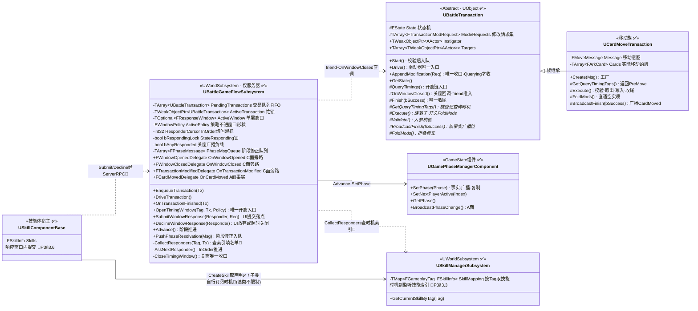
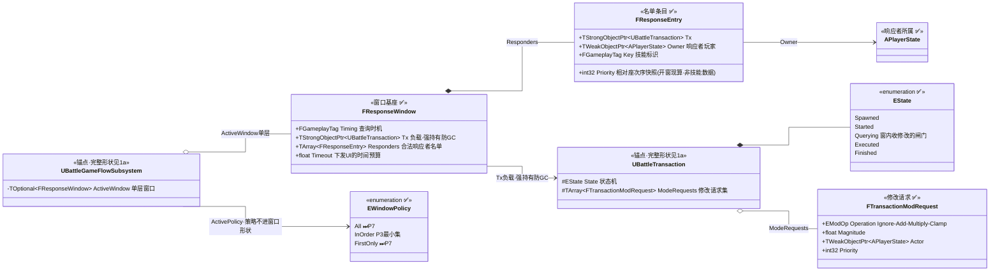
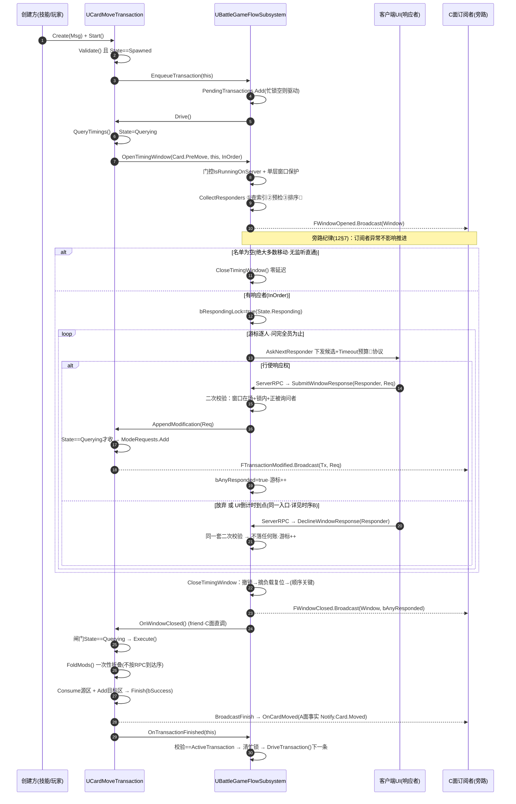
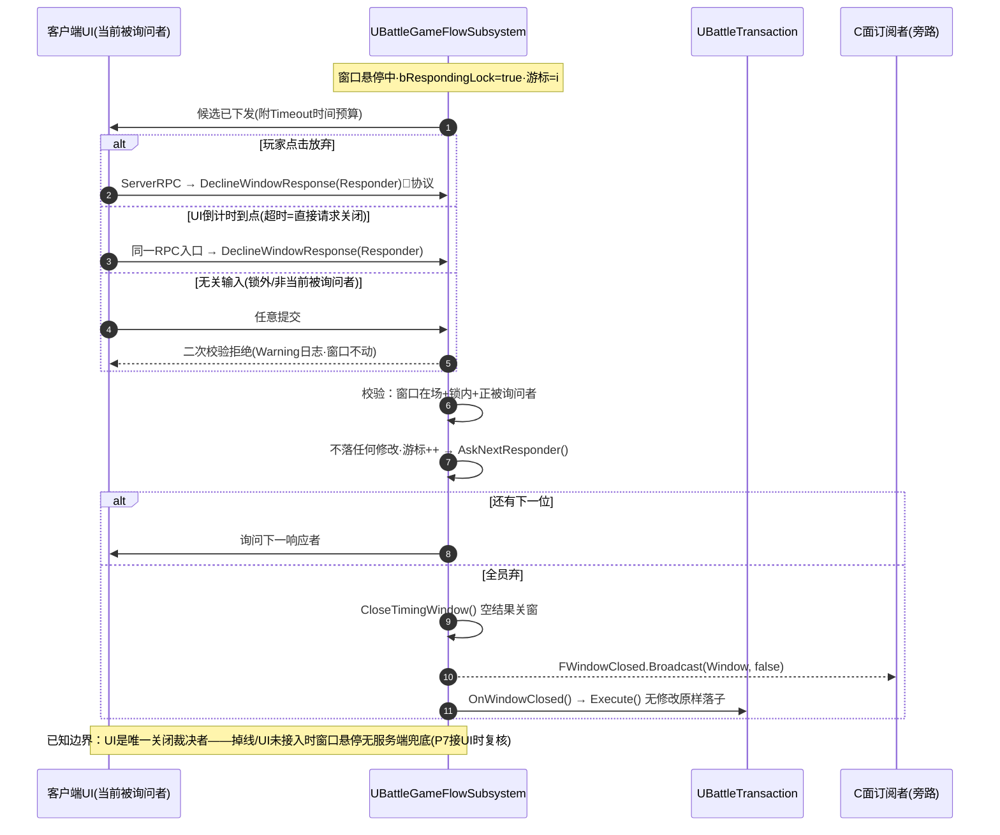
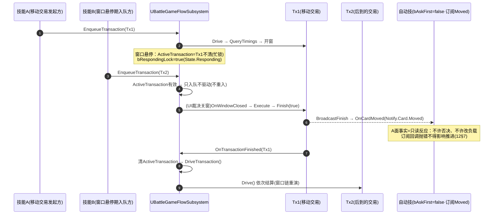

# P3 架构图集：时机总线与响应窗口

> 配套 `P3-时机总线与响应窗口施工指南` 与整体卷 `02/03/04/10/12`，以**代码现状为准**（命名对齐 `EventTypes.h` / `BattleGameFlowSubsystem` / `BattleTransaction`）。
> 标记口径：✅ = 已落地；🚧 = P3 待建（索引/接线/RPC 协议）；⏭ = 留后续阶段（P5/P6/P7）。
> 关闭裁决口径（全图集统一）：**关闭时机统一只通过 UI 决定**——`FResponseWindow.Timeout` 是下发给 UI 的时间预算，倒计时到点 UI 直接请求关闭（与"放弃"同一 RPC 入口）；引擎侧不持有任何定时器（P3 §3.5）。

## 1. UML 类图（当前代码形状）

> 拆成两张：**1a 引擎与协作者**（行为主轴）、**1b 窗口数据形状**（静态骨架）。每张图节点少、声明顺序即层序（每条边恰好跨一层），同层绕行折线自然消失；连线一律 `stepAfter` 直角单拐。

### 1a 引擎与协作者（行为主轴）

### 1b 窗口数据形状（静态骨架）

> 前两个类是**锚点**（完整形状见 1a，此处只列被引用的成员）；声明顺序即层序，每条边恰好跨一层——没有同层边，也就没有绕行折线。

## 2. 时序图 A：交易查询窗口全链路（✅ 已落地，验收 §4.2 的主干）

> `Start → 入队 → Drive → QueryTimings → OpenTimingWindow → 询问 → AppendModification → Close → OnWindowClosed → Execute → Finish → 踢链`

## 3. 时序图 B：UI 裁决关窗（放弃 / 倒计时到点 = 直接请求关闭）

> 引擎侧无定时器；`Timeout` 只是 UI 的时间预算，到点由 UI 主动请求关闭（P3 §3.5）。

## 4. 时序图 C：阶段机 `_Pre/_Post` 时机窗（🚧 设计目标形态，`Advance` 接线待落）

> 纯阶段时机 `Tx = nullptr`；技能修正走 `PushPhaseResolvation`（PhaseMsgQueue），不经 ModRequest 通道。验收 §4.1"判定前跳过"。

## 5. 时序图 D：忙锁与事实通知面（窗口悬停期入队不重入 + A 面只读订阅）

> 验收 §4.3 忙锁 + §4.6 事实侧回归：查询/通知两通道互不干扰。

## 6. 落地状态对照（画图时点）

| 图元 | 状态 | 备注 |
|---|---|---|
| 类图全部类型/委托声明 | ✅ | `EventTypes.h` / `ArkWarDelegates.h` / 两子系统 |
| 时序 A：开窗→收修改→关窗→Execute→踢链 | ✅ | 引擎侧全通；`CollectResponders` 空表直通 |
| 多查询时机逐个开窗（P3 §3.4） | ✅ | 基类游标 `QueryTimingCursor`：关一扇推一格、问完才 `Execute`；伤害族双时机（P4）即取即用 |
| 时机索引（①查表填名单） | ⚠本体✅/接线🚧 | `USkillManagerSubsystem::SkillTimings` + `Register/Unregister/GetSkillListeners` 已落（条目 `FSkillListenerEntry` 落 `ArkWarSkillTypes.h`）；`CollectResponders` 未接、技能子类的订阅/退订未落（基类不做限制、不代办，订退写在子类里；P3 §3.3.1/§3.3.5） |
| 技能组件宿主骨架 | ✅ | `USkillComponentBase::CreateSkill`（查重 → 取声明 → `bDeferred` 注册 → 挂 `ComponentTags`）/ `GetSkillTag()` / `OnCanActivate()` 钩子；**订阅/退订由子类自行实现，基类不限制**（P3 §3.3.1）；两条测试技能本体未建（P3 §3.6） |
| 候选下发 / 提交 RPC 协议 | 🚧 | `Submit/DeclineWindowResponse` 已是服务端落点（P3 §3.3） |
| 时序 C：`Advance` 遇 `_Pre/_Post` 停窗 | 🚧 | 现状 `_Pre/_Post` 直通（P3 §3.4① 接线点） |
| 两条测试技能（§3.6） | 🚧 | 自动技订阅 `Moved` + 主动技 `Judgment_Pre` 跳过 |
| 时序 B：UI 裁决关闭 | ✅协议/🚧UI | 引擎入口已落；UI 本体 P7 |
| `All` / `FirstOnly` 策略、响应链嵌套 | ⏭P7 | P3 单层窗口 + `InOrder` |
| 交易嵌套 `PushNestedTransaction` | ⏭P3留口/P5首用 | 字段+入口+拒绝分支（P3 §3.9） |
