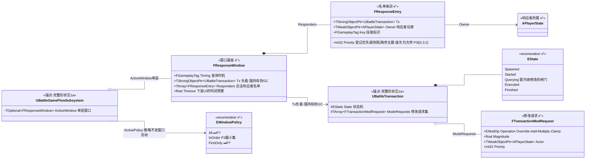
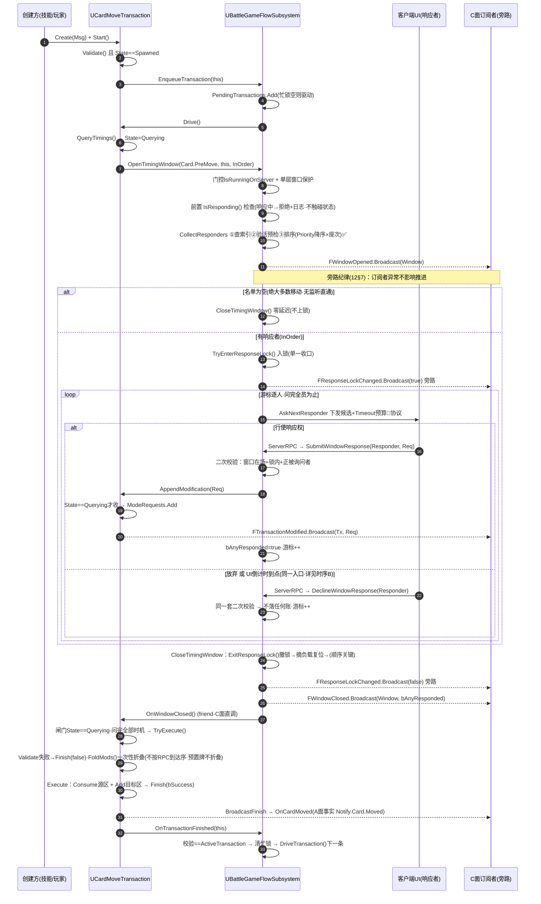
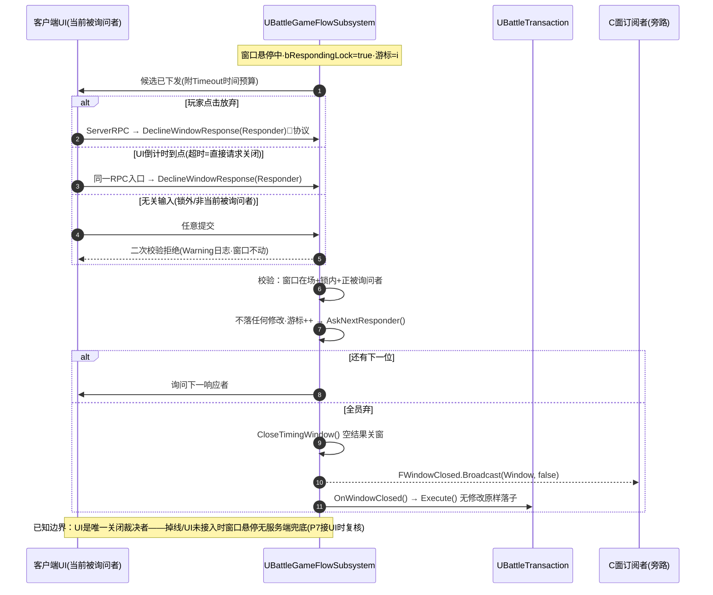
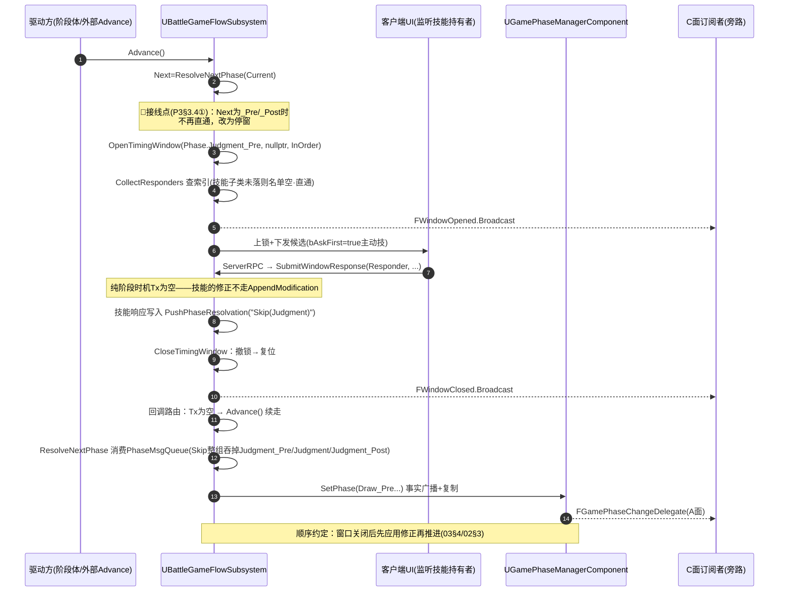
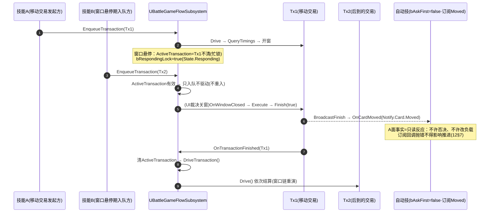

# P3 架构图集：时机总线与响应窗口

> 配套 `P3-时机总线与响应窗口施工指南` 与整体卷 `02/03/04/10/12`，以**代码现状为准**（命名对齐 `EventTypes.h` / `BattleGameFlowSubsystem` / `BattleTransaction`）。
> 标记口径：✅ = 已落地；🚧 = P3 待建（索引/接线/RPC 协议）；⏭ = 留后续阶段（P5/P6/P7）。
> 关闭裁决口径（全图集统一）：**关闭时机统一只通过 UI 决定**——`FResponseWindow.Timeout` 是下发给 UI 的时间预算，倒计时到点 UI 直接请求关闭（与"放弃"同一 RPC 入口）；引擎侧不持有任何定时器（P3 §3.5）。

## 1. UML 类图（当前代码形状）

> 拆成两张：**1a 引擎与协作者**（行为主轴）、**1b 窗口数据形状**（静态骨架）。每张图节点少、声明顺序即层序（每条边恰好跨一层），同层绕行折线自然消失；连线一律 `stepAfter` 直角单拐。

### 1a 引擎与协作者（行为主轴）

```mermaid
%%{init: {"flowchart": {"curve": "stepAfter"}}}%%
classDiagram
    direction LR

    class UBattleGameFlowSubsystem {
        <<UWorldSubsystem · 仅服务器 ✅>>
        -TArray~UBattleTransaction~ PendingTransactions 交易队列FIFO
        -TObjectPtr~UBattleTransaction~ ActiveTransaction 忙锁+GC锚UPROPERTY强持有
        -TOptional~FResponseWindow~ ActiveWindow 单层窗口
        -EWindowPolicy ActivePolicy 策略不进窗口形状
        -int32 ResponderCursor InOrder询问游标
        -bool bRespondingLock StateResponding锁(bool实现)
        -bool bAnyResponded 关窗广播负载
        -TArray~FPhaseMessage~ PhaseMsgQueue 阶段修正队列
        +FWindowOpenedDelegate OnWindowOpened C面旁路
        +FWindowClosedDelegate OnWindowClosed C面旁路
        +FTransactionModifiedDelegate OnTransactionModified C面旁路
        +FResponseLockChangedDelegate OnResponseLockChanged C面旁路·锁切换广播✅
        +FCardMovedDelegate OnCardMoved A面事实
        +EnqueueTransaction(Tx)
        +DriveTransaction()
        +OnTransactionFinished(Tx)
        +OpenTimingWindow(Tag, Tx, Policy) 唯一开窗入口(前置TryEnterResponseLock)
        +SubmitWindowResponse(Responder, Req) UI提交落点
        +DeclineWindowResponse(Responder) UI放弃或超时关闭
        +Advance() 阶段推进
        +PushPhaseResolvation(Msg) 阶段修正入队
        +bool IsResponding() const 单一查询接口(State.Responding真锁)
        +bool TryEnterResponseLock() 单一进入收口(已在响应中→拒绝+日志)
        +void ExitResponseLock() 单一退出收口(CloseTimingWindow调用)
        -CollectResponders(Tag, Tx) 查索引+预检+排序✅
        -AskNextResponder() InOrder推进
        -CloseTimingWindow() 关窗唯一收口
    }

    class UBattleTransaction {
        <<Abstract · UObject ✅>>
        #EState State 状态机
        #TArray~FTransactionModRequest~ ModeRequests 修改请求集
        #int32 QueryTimingCursor 多时机游标
        +TWeakObjectPtr~AActor~ Instigator
        +TArray~TWeakObjectPtr~AActor~~ Targets
        +Start() 校验后入队
        -Drive() 驱动器唯一入口(private·friend)
        +AppendModification(Req) 唯一收口·Querying才收
        +GetState()
        -QueryTimings() 开窗链入口·直通分支调TryExecute
        -OnWindowClosed() 关窗回调·friend准入·终点调TryExecute
        -TryExecute() Validate-FoldMods-Execute三段收口✅新增
        #Finish(bSuccess) 唯一收尾
        #GetQueryTimingTags()* 族登记查询时机
        #Execute()* 族落子(TryExecute保证进前必已校验折叠)
        #Validate()* 入参校验
        #BroadcastFinish(bSuccess)* 族事实广播位
        #FoldMods()* 折叠修正
    }

    class UCardMoveTransaction {
        <<移动族 ✅>>
        +TUniquePtr~FMoveMessage~ Message 移动意图(public)
        +TArray~FArkCard~ Cards 预置牌·Execute后回写实际取出
        +Create(Msg, CardsToMove) 工厂
        +GetMessage() 只读意图·无窗口闸门✅
        +ModifyMessage(Modifier) 结构直写·Querying才收·两纪律快照还原✅
        #GetQueryTimingTags() 返回PreMove
        #Execute() 取出-写入-收尾(校验折叠由TryExecute保证)
        #FoldMods() 已填实·Override终局短路-ΣAdd×ΠMul-Clamp-预置牌不折叠·float域末次RoundToInt✅
        #BroadcastFinish(bSuccess) 广播CardMoved·仅成功时
    }

    class USkillManagerSubsystem {
        <<UWorldSubsystem ✅>>
        -TMap~FGameplayTag_TSharedPtrFSkillInfo~ SkillMapping 按Tag取技能
        -TMap~FGameplayTag_TArrayFSkillListenerEntry~ SkillTimings 时机→监听索引本体✅
        +GetCurrentSkillByTag(Tag)
        +RegisterSkillTiming() / UnregisterSkillTiming() / GetSkillListeners() ✅
        +OnAllOperatorSelected() / AppendSkill() 注册表填充
        CollectResponders 查表+排序(Priority降序×座次)✅
    }

    class UGamePhaseManagerComponent {
        <<GameState组件 ✅>>
        +SetPhase(Phase) 事实·广播·复制
        +SetNextPlayerActive(Index)
        +GetPhase()
        +BroadcastPhaseChange() A面
    }

    class USkillComponentBase {
        <<技能体宿主 ✅>>
        -TSharedPtr<FSkillInfo> SkillInfo
        +CreateSkill() / GetSkillTag() / OnCanActivate() 纯虚
        #RegisterActivateTiming() 订·纯虚·框架已备(内容/调用点归子类·非P3)
        #UnRegisterActivateTiming() 退·纯虚·EndPlay 兜底回调
        响应窗口内提交 🚧P3§3.6
    }

    %% 主轴（左→右）：技能体 → 流程子系统 → 交易基类 → 族
    USkillComponentBase ..> UBattleGameFlowSubsystem : Submit/Decline经ServerRPC🚧
    UBattleGameFlowSubsystem ..> UBattleTransaction : friend·OnWindowClosed直调
    UBattleTransaction <|-- UCardMoveTransaction : 族继承

    %% 协作组件（主轴上方一字排开）
    UBattleGameFlowSubsystem --> UGamePhaseManagerComponent : Advance·SetPhase
    USkillComponentBase --> USkillManagerSubsystem : CreateSkill取声明✅ / 订退钩子框架已备✅(内容归子类·非P3)
    UBattleGameFlowSubsystem ..> USkillManagerSubsystem : CollectResponders查时机索引✅ / 写入方归子类(非P3)
```

### 1b 窗口数据形状（静态骨架）

> 前两个类是**锚点**（完整形状见 1a，此处只列被引用的成员）；声明顺序即层序，每条边恰好跨一层——没有同层边，也就没有绕行折线。

## 2. 时序图 A：交易查询窗口全链路（✅ 已落地，验收 §4.2 的主干）

> `Start → 入队 → Drive → QueryTimings → OpenTimingWindow → 询问 → AppendModification → Close → OnWindowClosed → Execute → Finish → 踢链`

## 3. 时序图 B：UI 裁决关窗（放弃 / 倒计时到点 = 直接请求关闭）

> 引擎侧无定时器；`Timeout` 只是 UI 的时间预算，到点由 UI 主动请求关闭（P3 §3.5）。

## 4. 时序图 C：阶段机 `_Pre/_Post` 时机窗（🚧 设计目标形态，`Advance` 接线待落）

> 纯阶段时机 `Tx = nullptr`；技能修正走 `PushPhaseResolvation`（PhaseMsgQueue），不经 ModRequest 通道。验收 §4.1"判定前跳过"。

## 5. 时序图 D：忙锁与事实通知面（窗口悬停期入队不重入 + A 面只读订阅）

> 验收 §4.3 忙锁 + §4.6 事实侧回归：查询/通知两通道互不干扰。

## 6. 落地状态对照（画图时点）

| 图元 | 状态 | 备注 |
|---|---|---|
| 类图全部类型/委托声明 | ✅ | `EventTypes.h` / `ArkWarDelegates.h` / 两子系统 |
| 时序 A：开窗→收修改→关窗→Execute→踢链 | ✅ | 引擎侧全通；`CollectResponders` 已接索引（索引无写入方时空表直通）；`State.Responding` 真锁（bool + 三 API 单一收口）已落 |
| `State.Responding` 真锁（框架期） | ✅ | `bRespondingLock` bool + `IsResponding()`/`TryEnterResponseLock()`/`ExitResponseLock()` 三 API（`UBattleGameFlowSubsystem`，单一收口）+ `FResponseLockChanged` 委托（`ArkWarDelegates.h` 已落）；`OpenTimingWindow` 入口前置拒绝嵌套 + `CloseTimingWindow` 撤锁 + `Submit/DeclineWindowResponse` 二次校验；调用方均按 `IsResponding()` 查 |
| `State.Responding` 升级 GE 阻断 | ⏭P4/P5 | 需 ASC 绑定到 PlayerState/Pawn + `State.Responding` GameplayTag + `TargetTagsGameplayEffect` 资产 + 技能/出牌侧 GAS 拒绝路径——非 P3 范围 |
| 多查询时机逐个开窗（P3 §3.4） | ✅ | 基类游标 `QueryTimingCursor`：关一扇推一格、问完才 `Execute`；伤害族双时机（P4）即取即用 |
| 时机索引（①查表→③排序填名单） | ✅ 本体/接线/框架 | `USkillManagerSubsystem::SkillTimings` + `Register/Unregister/GetSkillListeners` 已落（条目 `FSkillListenerEntry` 落 `ArkWarSkillTypes.h`，含技能级 `Priority` 降序主键）；注册表填充 `OnAllOperatorSelected`/`AppendSkill` 已落；`CollectResponders` 已接索引 + 验活预检 + `StableSort`（`Priority` 降序 × 座次轮转、非法座位沉底，P3 §3.3.2/§3.3.5）。订退钩子框架即止（两纯虚 + `EndPlay` 兜底回调），**子类内容不属 P3**（随 `P6` §5）→ 当前无写入方、名单恒空（P3 §3.3.1/§7） |
| 技能组件宿主骨架 | ✅ | `USkillComponentBase::CreateSkill`（查重 → 取声明 → 延迟注册：`bDeferred` 创建 → 挂 `ComponentTags` → `RegisterComponent`，Tag 先于 `BeginPlay` 就位）/ `GetSkillTag()` / `OnCanActivate(Timing, Tx)` 钩子（**签名已带窗口负载**，`AskNextResponder` 传 `ActiveWindow->Tx`）+ 订退钩子 `RegisterActivateTiming()`/`UnRegisterActivateTiming()`（**两个纯虚，框架已备**；内容与订阅调用点归子类、非 P3 范围；退订由 `EndPlay` 兜底，P3 §3.3.1/§7）；两条测试技能本体未建、`Battle/Abilities/` 为空目录（P3 §3.6） |
| 候选下发 / 提交 RPC 协议 | 🚧 | `Submit/DeclineWindowResponse` 已是服务端落点（P3 §3.3）；**下行通道 = ClientRPC 点对点 + 扁平 DTO，不走属性复制**（`11` §5.1/§5.2），RPC 两壳 + `WindowSerial` 待落 |
| 窗内修改链路（`04` §4.1 通道分工：数值折叠 vs 结构直写） | ✅ 全通（2026-09-16 收口） | 链路全到位：基类 `TryExecute()`（Validate → FoldMods → Execute 三段收口，`QueryTimings` 直通分支与 `OnWindowClosed` 终点均调它）+ `CardMove::FoldMods` 填实（`EModOp` = `Override/Add/Multiply/Clamp`，`Ignore` 已移除、`Override` 终局短路；预置牌不折叠；全程 float 域、末次一次 `RoundToInt` 回填）+ **折叠后自判已落**（`Execute` 开头 `_Count <= 0 → Finish(false)`——折零即"被防"：不落子、不广播 `Moved` 事实）+ `OnCanActivate(Timing, Tx)` 递窗口负载（`AskNextResponder` 传 `ActiveWindow->Tx`）+ `GetMessage()`/`ModifyMessage()` 族干预点（Querying 闸门 + 两条纪律快照还原）。`Ignore`/`bIgnored` 口径结于**定稿 (a)**（2026-09-16）：不恢复 `bIgnored`/`bIgnoreModes` 成员，"免疫/被防"由 `Override(0)` 折零表达（P3 施工指南 §7） |
| 时序 C：`Advance` 遇 `_Pre/_Post` 停窗 | ✅ | 已落（2026-09-16 复核 `BattleGameFlowSubsystem.cpp:216-227`）：查索引判空 → `OpenTimingWindow(Timing, nullptr, InOrder)` → 停窗返回；关窗路由 `Tx == nullptr → Advance()`（`:664-671`）续走，修正经 `PhaseMsgQueue` 由 `ResolveNextPhase` 消费。**停窗范围含 `Begin`/`Finish`**（比原方案宽，非笔误） |
| 两条测试技能（§3.6） | 🚧 | 自动技订阅 `Moved` + 主动技 `Judgment_Pre` 跳过 |
| 时序 B：UI 裁决关闭 | ✅协议/🚧UI | 引擎入口已落；UI 本体 P7 |
| `All` / `FirstOnly` 策略、响应链嵌套 | ⏭P7 | P3 单层窗口 + `InOrder` |
| 交易嵌套 `PushNestedTransaction` | ✅字段与入口（真实使用者留 P5） | `NestedStack` + Push/Pop + 收尾守卫栈顶判定已落（2026-09-16）；**无深度上限成员**（上限只作设计约定）；**父的续行点待裁**（P3 §3.9） |
